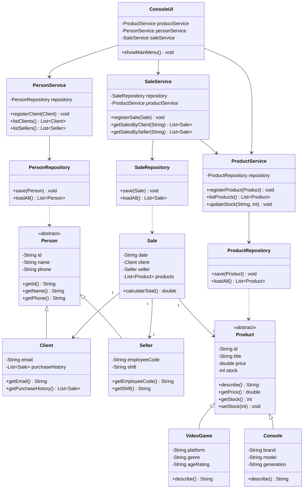

# Class Diagram

```mermaid
classDiagram
    %% MODEL LAYER
    class Person {
        <<abstract>>
        -String id
        -String name
        -String phone
        +getId() String
        +getName() String
        +getPhone() String
    }
    class Client {
        -String email
        -List~Sale~ purchaseHistory
        +getEmail() String
        +getPurchaseHistory() List~Sale~
    }
    class Seller {
        -String employeeCode
        -String shift
        +getEmployeeCode() String
        +getShift() String
    }
    class Product {
        <<abstract>>
        -String id
        -String title
        -double price
        -int stock
        +describe()* String
        +getPrice() double
        +getStock() int
        +setStock(int) void
    }
    class VideoGame {
        -String platform
        -String genre
        -String ageRating
        +describe() String
    }
    class Console {
        -String brand
        -String model
        -String generation
        +describe() String
    }
    class Sale {
        -String date
        -Client client
        -Seller seller
        -List~Product~ products
        +calculateTotal() double
    }

    Person <|-- Client
    Person <|-- Seller
    Product <|-- VideoGame
    Product <|-- Console
    Sale "1" --> "1" Client
    Sale "1" --> "1" Seller
    Sale "1" --> "1..*" Product

    %% PERSISTENCE LAYER
    class ProductRepository {
        +save(Product) void
        +loadAll() List~Product~
    }
    class PersonRepository {
        +save(Person) void
        +loadAll() List~Person~
    }
    class SaleRepository {
        +save(Sale) void
        +loadAll() List~Sale~
    }
    ProductRepository ..> Product
    PersonRepository ..> Person
    SaleRepository ..> Sale

    %% SERVICE LAYER
    class ProductService {
        -ProductRepository repository
        +registerProduct(Product) void
        +listProducts() List~Product~
        +updateStock(String, int) void
    }
    class PersonService {
        -PersonRepository repository
        +registerClient(Client) void
        +listClients() List~Client~
        +listSellers() List~Seller~
    }
    class SaleService {
        -SaleRepository repository
        -ProductService productService
        +registerSale(Sale) void
        +getSalesByClient(String) List~Sale~
        +getSalesBySeller(String) List~Sale~
    }
    ProductService --> ProductRepository
    PersonService --> PersonRepository
    SaleService --> SaleRepository
    SaleService --> ProductService

    %% UI LAYER
    class ConsoleUI {
        -ProductService productService
        -PersonService personService
        -SaleService saleService
        +showMainMenu() void
    }
    ConsoleUI --> ProductService
    ConsoleUI --> PersonService
    ConsoleUI --> SaleService
```
