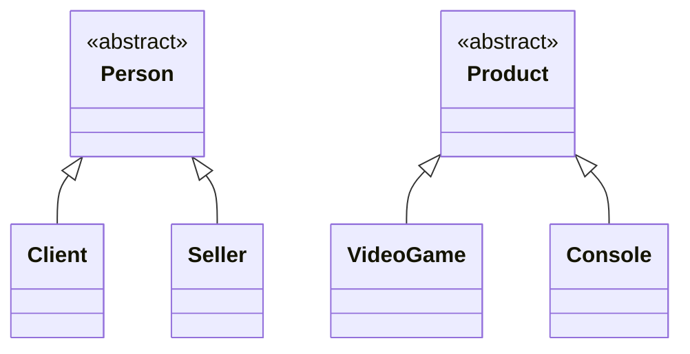

# Hierarchy Diagram

```mermaid
classDiagram
    class Person {
        <<abstract>>
    }
    class Client
    class Seller
    Person <|-- Client
    Person <|-- Seller

    class Product {
        <<abstract>>
    }
    class VideoGame
    class Console
    Product <|-- VideoGame
    Product <|-- Console
```
