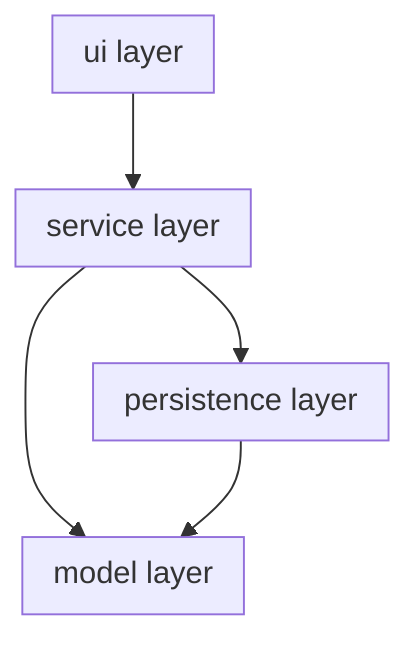

# Layers Diagram

> Show the four layers (model, persistence, service, ui), which classes
> belong to each, and the allowed dependency direction:
> ui -> service -> persistence -> model (model depends on nothing).

