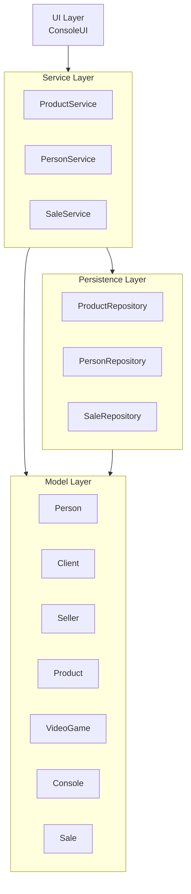

# Layers Diagram

```mermaid
graph TD
    UI["UI Layer<br/>ConsoleUI"] --> SERVICE
    subgraph SERVICE["Service Layer"]
        ProductService
        PersonService
        SaleService
    end
    SERVICE --> PERSISTENCE
    SERVICE --> MODEL
    subgraph PERSISTENCE["Persistence Layer"]
        ProductRepository
        PersonRepository
        SaleRepository
    end
    PERSISTENCE --> MODEL
    subgraph MODEL["Model Layer"]
        Person
        Client
        Seller
        Product
        VideoGame
        Console
        Sale
    end
```
